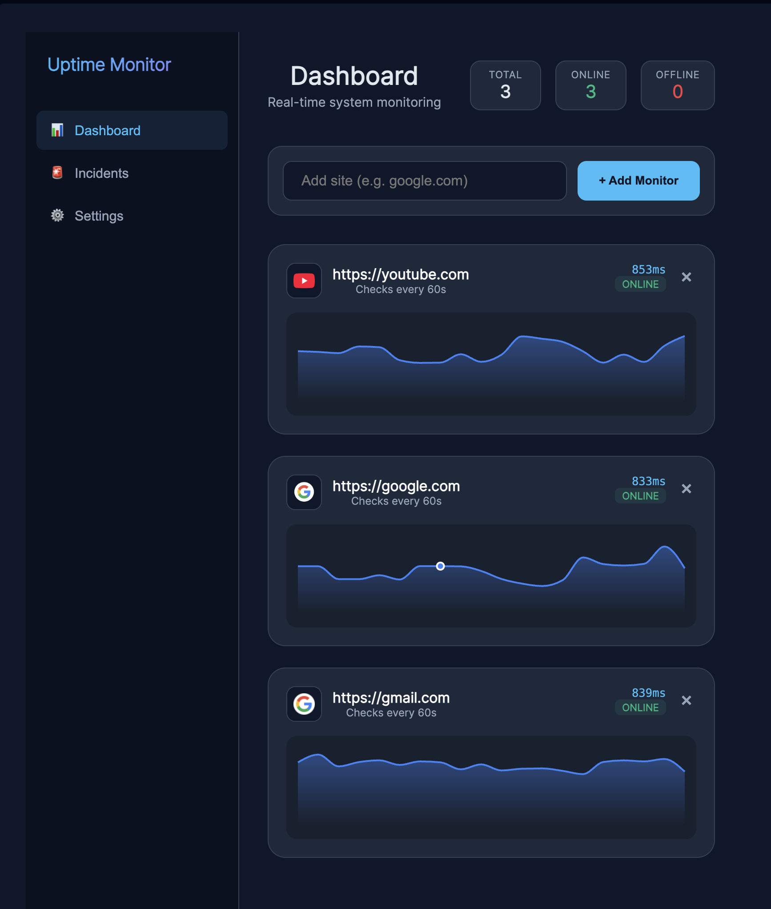
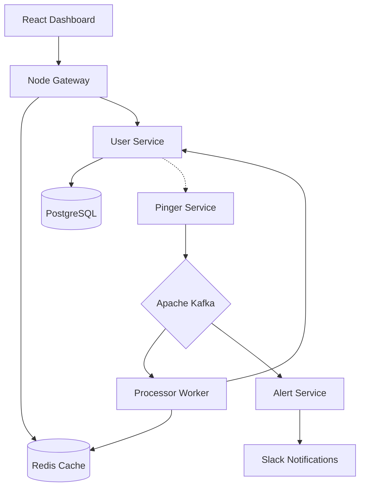

# Uptime Monitor

[](https://github.com/klawd3l04/Uptime_monitor/actions/workflows/python-ci.yml)

**Uptime Monitor** is a production-grade, distributed microservices ecosystem built for real-time health tracking and multi-channel alerting. Leveraging a high-throughput event-driven architecture, it ensures sub-millisecond observability for mission-critical web targets.



## Architecture & Core Decisions

This project follows a decoupled, event-driven microservices architecture to ensure it can handle thousands of concurrent monitoring targets without performance degradation.

- **Event-Driven Pipeline (Apache Kafka)**: We use Kafka as the backbone for result streaming. This allows the system to remain responsive: Pinger services fire-and-forget results, while Processor and Alert services consume them at their own pace.
- **Hybrid Storage Strategy**: 
    - **PostgreSQL**: Used for "source of truth" data requiring strong consistency (User accounts, Monitor settings, Persistent Uptime stats).
    - **Redis**: Used as a high-speed cache for real-time status and graph history, ensuring that the dashboard data is served with sub-millisecond latency.
- **Distributed Locking**: Using Redis to prevent race conditions where multiple pinger instances might attempt to check the same URL simultaneously.
- **Horizontal Scalability**: Every service in this stack is stateless and containerized, allowing for seamless scaling in a Kubernetes environment.

### Relationship Diagram



## How it Works (End-to-End Flow)

1.  **Subscription**: The **Pinger Service** periodically fetches active monitors from the **User Service** (authenticated via a shared `INTERNAL_API_KEY`).
2.  **Scheduling**: Each monitor is scheduled in the Pinger's `apscheduler` using its specific `interval_seconds`.
3.  **Check**: The Pinger executes an asynchronous HTTP/HTTPS request.
4.  **Streaming**: Results are pushed into an **Apache Kafka** topic (`monitoring-results`).
5.  **Processing**: The **Processor Service** consumes these results, updates persistent uptime stats in PostgreSQL, and caches the latest status in Redis.
6.  **Alerting**: The **Alert Service** (independently consuming from Kafka) detects state changes (UP -> DOWN) and triggers a notification to Slack.
7.  **Visualization**: The **Dashboard** fetches real-time data from the Node.js Gateway, which queries Redis for sub-millisecond response times.

## Key Features

- **Precise Per-Monitor Scheduling**: Individual intervals (10s to 24h) respected via distributed worker scheduling.
- **State Persistence**: Alert state and monitoring status survive service restarts thanks to Redis-backed idempotency.
- **Production Hardening**: Enforced environment variables, no debug modes, and secure internal API communication.
- **Kubernetes Ready**: Full manifests with Resource Limits, Health Probes (Liveness/Readiness), and K8s Secrets.
- **Unit Tested**: Core logic covered by `pytest` with CI integration via GitHub Actions.

## Tech Stack

- **Languages**: Python 3.11+, Node.js 20+, JavaScript (React)
- **Frameworks**: FastAPI, Flask, Vite, Express
- **Messaging**: Apache Kafka (confluent-kafka)
- **Data**: PostgreSQL 15, Redis 7
- **Infra**: Docker, Docker Compose, Kubernetes, GitHub Actions

## Getting Started

### 1. Environment Configuration

Copy the example environment file and fill in your details:
```bash
cp .env.example .env
```

### 2. Launch with Docker

```bash
docker-compose up -d --build
```

Access the dashboard at: [http://localhost:8080](http://localhost:8080)

### 3. Running Kubernetes (Hardened)

```bash
kubectl apply -k k8s/base
```

---
This project was developed to explore high-performance microservices patterns and event-driven observability at scale.
